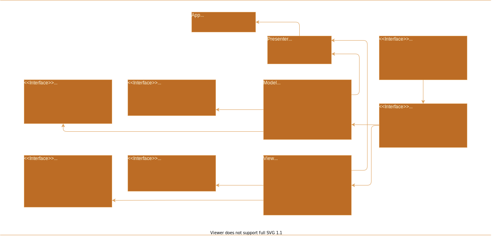
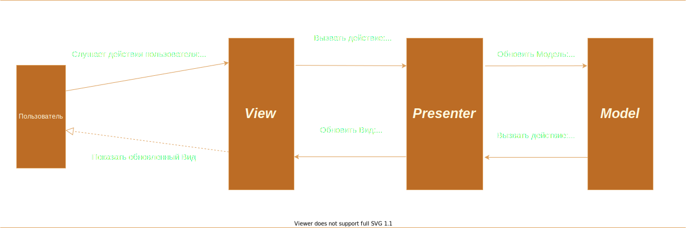

# Range Slider

Плагин для jQuery, реализующий слайдер. \
[Демо](https://ramai1990.github.io/rangeSlider/dist/index.html)

## Сборка проекта

```console
$ npm i
$ npm run build
$ npm run dev
```

## Запуск сервера

```console
$ npm run start
```

## Запуск тестов

```console
$ npm run test
```

## Начало работы

Убедитесь что Вы подключили `jQuery`, скомпилированные файлы находятся в папке `dist`

```$xslt
<html>
  <head>
    ...
    <link href="jquery.range.css" rel="stylesheet"></head>
  </head>
  <body>
    ...
    <script type="text/javascript" src="jquery.min.js"></script>
    <script type="text/javascript" src="jquery.range.js"></script>
  </body>
</html>
```


### Использование

Вызовите функцию `.range ()` для любого ввода диапазона в jQuery, чтобы создать экземпляр ползунка диапазона элементов.

```$xslt
$('input[type="range"]').range();
```

### Настройка с помощью параметров

Для каждого экземпляра ползунка диапазона можно задать множество параметров

```$xslt
$('input[type="range"]').range({
  min: 5000,
  max: 15000,
  value: 5500,
  value2: 10000,
  range: true,
  showGrid: true,
});
```
### Настройка с помощью data-* attributes

Вы также можете изменить каждый параметр, используя data -* attributes. Если указан логический параметр, то он имеет значение true.

```$xslt
<input type="range"
  data-min="5000"
  data-max="15000"
  data-value="5500"
  data-value2="10000"
  data-range
  data-show-grid
/>
```

Затем просто вызовите `range()` без аргументов.


### Публичные методы
```$xslt
// 1. Инициализация экземпляра ползунка диапазона
$('input[type="range"]').range();

// 2. Сохраните экземпляр с общедоступными методами api в переменную
const slider = $('input[type="range"]').data('api');

// 3. Обновите содержимое ползунка диапазона (это изменит позиции маркеров)
slider.update({
  value: 10,
  value2: 20,
  range: true,
});
```

### Использование обратных вызовов

Есть два обратных вызова: `onCreate` и `onChange`. Каждый обратный вызов будет получать объект данных с текущим состоянием ползунка диапазона.

```$xslt
$('input[type="range"]').range({
  onCreate: (state) => {
    // Вызывается сразу после инициализации экземпляра ползунка диапазона
    console.log(state.min);
    console.log(state.max);
    console.log(state.value);
  }
  onChange: (state) => {
    // Вызывается при каждом изменении состояния ползунка диапазона. Например, изменяется положение ручки
    console.log(state.value);
    console.log(state.value2);
  }
});
```

### Параметры плагина
|Параметр | Тип | По умолчанию | Описание |
|----------|------|---------|-------------|
| min | number| 0 |Минимальное значение. |
| max | number| 100| Максимальное значение. |
| step | number | 1 | Шаг изменения значений. |
| value | number | 0 | Текущее значение. Наименьшее значение диапазона, когда `range == true`. |
| value2 | number | null | Наибольшее значение диапазона. Равно значению `max`, когда `range == true`.|
| range | boolean | false| Разрешить ли пользователю выбирать диапазон между двумя значениями. |
| vertical | boolean | false | Слайдер имеет вертикальную ориентацию.|
| showBubble | boolean | false | Каждый дескриптор имеет пузырь, отображающий текущее значение.|
| showGrid | boolean | false | Показать сетку значений.|
| gridDensity | number | 1 | Количество единиц сетки. Например, укажите 10, если вы хотите разделить сетку слайдера диапазона на 10 единиц. |
| onCreate | function | null | Обратный вызов. Вызывается сразу после инициализации экземпляра ползунка диапазона. |
| onChange | function | null | Обратный вызов. Вызывается при каждом изменении состояния ползунка диапазона. Например, изменяется положение ручки. |

## Описание архитектуры
Модель и представление рассматриваются независимыми друг от друга и взаимодействуют между собой на основании интерфейсов `State`, `LayerObservable`, `SliderViewExtraData`, `SliderModelExtraData`. 
Экземпляр класса `Observer` в `Model` и `View` представляет собой реализацию паттерна “Observer” и предназначен для 
коммуникации между моделью и представлением (другими словами, для передачи в параметры метода модели данных из представления 
и наоборот - метод представления может быть вызван с данными из модели). Методы, при помощи которых происходит коммуникация 
между слоями приложения, описаны в контракте `LayerObservable`, реализованы в классах `Model` и `View` и связываются в `Presenter` 
с конечным методом из противоположной сущности функцией обратного вызова.

### Model
Здесь хранится состояние приложения (state: State) и реализованы методы для его модификации.

### MainView
Композиция классов представления. Главный класс представления. В представлении реализованы методы для отображения 
состояния приложения в соответствии с интерфейсом State.

### Presenter
Тут модель и представление связываются, ждут друг от друга сообщений и реагируют на них вызовом соответствующего метода.

### Диаграммы UML
#### Диаграмма обозначений классов:


#### Схема взаимодействия слоев:

