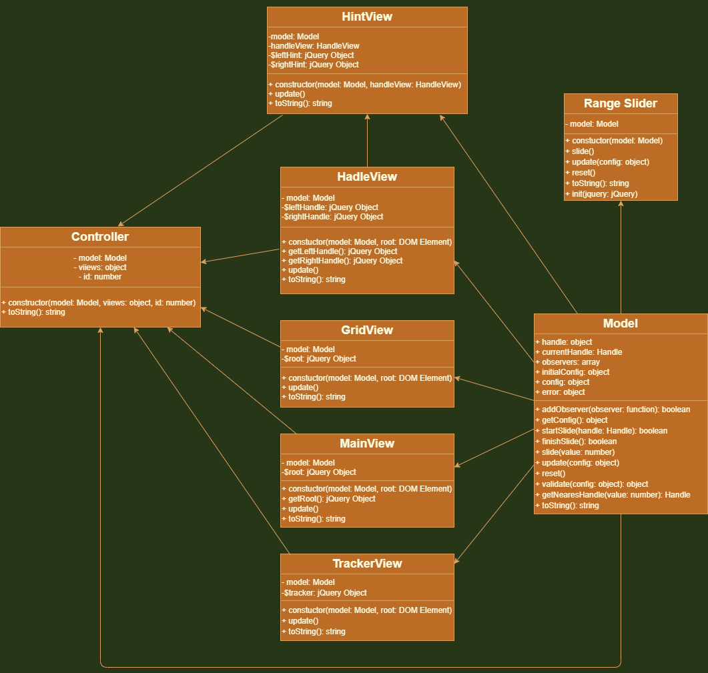
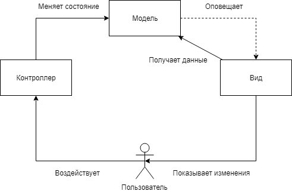

# Range Slider

Плагин для jQuery, реализующий слайдер. \
[Демо](https://ramai1990.github.io/rangeSlider/blob/master/dist/index.html)

## Сборка проекта

```console
$ npm i
$ npm run build
$ npm run dev
```

## Запуск сервера

```console
$ npm run start
```

## Запуск тестов

```console
$ npm run test
```

## Использование

Для использования плагина вызовите его метод **init**, передав в качестве параметра объект jQuery.

```js
const $ = require("jquery");
const RangeSlider = require("range-slider");

RangeSlider.init($);
$(".slider").rangeSlider();
```

## API

### Опции

| Название       | HTML-атрибут         | Значение по умолчанию | Тип данных | Описание                                                     |
| -------------- | -------------------- | --------------------- | ---------- | ------------------------------------------------------------ |
| min            | data-min             | 0                     | number     | Минимальное значение слайдера                                |
| max            | data-max             | 50                    | number     | Максимальное значение слайдера                               |
| range          | data-range           | false                 | boolean    | Если true, у слайдера будет два ползунка                     |
| from           | data-from            | 0                     | number     | Значение левого ползунка                                     |
| to             | data-to              | 10                    | number     | Значение правого ползунка                                    |
| step           | data-step            | 1                     | number     | Шаг слайдера                                                 |
| vertical       | data-vertical        | false                 | boolean    | Если true, слайдер будет вертикальным                        |
| displayHint    | data-display-hint    | false                 | boolean    | Если true, над ползунками будет показано их текущее значение |
| displayTracker | data-display-tracker | false                 | boolean    | Если true, будет показан трекер                              |
| displayGrid    | data-display-grid    | false                 | boolean    | Если true, будет показана сетка                              |
| gridStep       | data-grid-step       | 10                    | number     | Шаг сетки                                                    |

### Коллбэки

| Название | Описание                                                                                                       |
| -------- | -------------------------------------------------------------------------------------------------------------- |
| onInit   | Вызывается при создании слайдера                                                                               |
| onStart  | Вызывается, когда пользователь начинает двигать слайдер                                                        |
| onSlide  | Вызывается, когда пользователь пытается сдвинуть слайдер. Будет вызываться даже если значение не было изменено |
| onChange | Вызывается, когда пользователь изменяет значение слайдера                                                      |
| onFinish | Вызывается, когда пользователь прекращает двигать слайдер                                                      |
| onUpdate | Вызывается, когда был вызван один из методов **update** или **reset**                                          |

Каждый коллбэк при вызове принимает объект с полной конфигурацией слайдера.

### Публичные методы

```js
const $ = require("jquery");
const RangeSlider = require("range-slider");

// 1. Подготавливаем jQuery
RangeSlider.init($);

// 2. Инициализируем объект слайдера
$(".slider").rangeSlider();

// 3. Сохраняем объект в переменную
const slider = $(".slider").data("range-slider");

// 4. Изменяем конфигурацию слайдера
slider.update({
  range: true,
  from: 20,
  to: 30,
  displayHint: true,
  displayTracker: true,
  displayGrid: true,
  gridStep: 1,
});

// 5. Изменяем значения левого и правого ползунка
slider.slide(slider.handle.FROM, 4);
slider.slide(slider.handle.TO, 7);

// 6. Возвращаем слайдер к начальным настройкам
slider.reset();
```

## Архитектура

Все приложение построено по принципу MVC (Model-View-Controller) и разделено на несколько слоев. Ниже представлено описание структуры и их взаимодействия между собой.

### Модель

Самый независимый слой. Здесь находится вся бизнес-логика приложения. Не производит рассчетов, относящихся к отображению элементов. Представлен в виде класса **Model(...configs: object)**.

У модели есть одно публичное поле:

- **handle: object** \
  Объект, имеющий свойства FROM и TO. Определяет левый и правый ползунок соответственно.

И несколько публичных методов:

- **addObserver(observer: function): boolean** \
  Добавляет нового подписчика _observer_, который будет слушать модель. Возвращает true, если подписчик был добавлен, иначе - false.

- **getConfig(): object** \
  Возвращает конфигурацию модели.

- **startSlide(handle: Handle): boolean** \
  Определяет, какой ползунок будет передвигаться при помощи метода slide. Возвращает true, если слайдер готов к движению, иначе - false. При успехе вызывает коллбэк onStart.

- **slide(value: number)** \
  Передвигает выбранный ползунок на значение _value_. Вызывает коллбэк onSlide (всегда) и onChange (если значение было изменено).

- **finishSlide(): boolean** \
  Завершает передвижение ползунка. Возвращает true, если до этого был успешно вызван метод startSlide, иначе - false. При успехе вызывает коллбэк onFinish.

- **update(config: object)** \
  Обновляет конфигурацию модели.

- **reset()** \
  Возвращает конфигурацию модели к начальным настройкам.

- **validate(config: object): object** \
  Проверяет конфигурацию _config_ на ее корректность и возвращает правильную. Если у какого-либо параметра обнаружен неверный тип данных, будет выброшено исключение.

- **getNearestHandle(value: number): Handle** \
  Возвращает ползунок, который находится ближе всего к значению _value_.

- **toString(): string** \
  Возвращает модель в виде JSON-строки.

### Вид

Слой производит рассчеты, связанные с отображением элементов. В данном случае он представлен в виде нескольких классов: \
\> **SliderView(model: Model, root: DOM Element)** - полоска слайдера и сам слайдер. Основной класс. \
\> **HandleView(model: Model, root: DOM Element)** - ползунки. \
\> **HintView(model: Model, handleView: HandleView)** - подсказки со значениями ползунков. Зависит от HandleView. \
\> **TrackerView(model: Model, root: DOM Element)** - трекер (цветная полоска возле ползунков). \
\> **GridView(model: Model, root: DOM Element)** - сетка.

Каждый вид имеет два публичных метода:

- **update()** \
  Обновляет элемент слайдера.

- **toString(): string** \
  Возвращает вид в виде JSON-строки.

### Контроллер

Слой реагирует на действия пользователя и вызывает нужные методы модели. Представлен в виде класса **Controller(model: Model, views: object, id: number)**.

Объект views, который передается в конструкторе, представляет из себя коллекцию видов, необходимых для работы слайдера. Имеет следующие свойства: \
\> **sliderView: SliderView** \
\> **handleView: HandleView** \
\> **hintView: HintView** \
\> **trackerView: TrackerView** \
\> **gridView: GridView**

Контроллер имеет только один публичный метод:

- **toString(): string** \
  Возвращает контроллер в виде JSON-строки.

### Диаграмма классов

<div align="center">
    
</div>

### Взаимодействие слоев

- Вид подписывается на уведомления модели и становится ее подписчиком
- Пользователь взаимодействует со слайдером
- Контроллер реагирует на действия пользователя и вызывает нужные методы модели
- Модель обновляется и сообщает об этом всем своим подписчикам
- Подписчики обновляются исходя из новой конфигурации модели

<div align="center">
    
</div>
